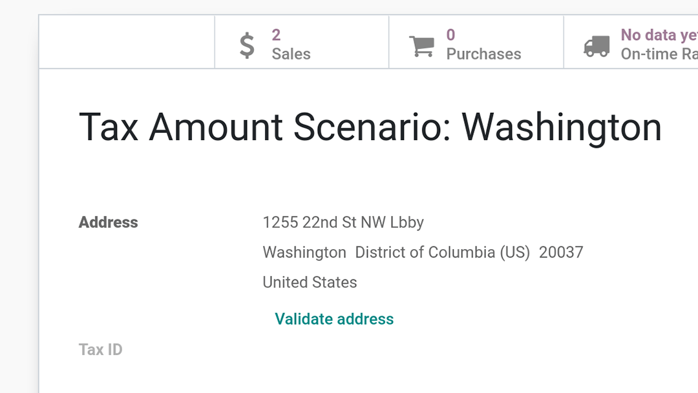

==================
Avatax Integration
==================

AvaTax is a sales tax integration that automates tax calculations and the tax filing process.

.. _avatax/credentials:

Credential configuration
========================

Avatax can be configured in :menuselection:`Accounting --> Configuration --> Settings`. If you do
not yet have credentials, follow the **How to Get Credentials** link in the **Settings** window for
Avatax.

.. image:: avatax/avatax-01.png
   :align: center
   :alt: Configure Avatax settings

.. _avatax/tax-mapping:

Tax Mapping
===========

The Avatax integration is available on Sale Orders and Invoices with the included Avatax fiscal
position.

Before using the integration, specify an Avatax Category on the product categories you use.

Product categories may be overridden or set on individual products as well.

.. _avatax/address-mapping:

Address validation
==================

Manually validate customer addresses by clicking the **Validate address** link in the customer
form view.

In the wizard that pops up, choose to keep the newly validated address or the original address if
preferred.

.. _avatax/tax-calculation:

Tax calculation
===============

The Avatax integration will automatically calculate taxes on Odoo quotations and invoices when
confirming them. Alternatively, taxes may be calculated manually by using the **Compute taxes
using Avatax** button when these documents are in draft.

Use the **Avalara Code** field that's available on customers, quotations and invoices to
cross-reference data in Odoo and Avatax.

.. seealso::
   - :doc:`fiscal_positions`
